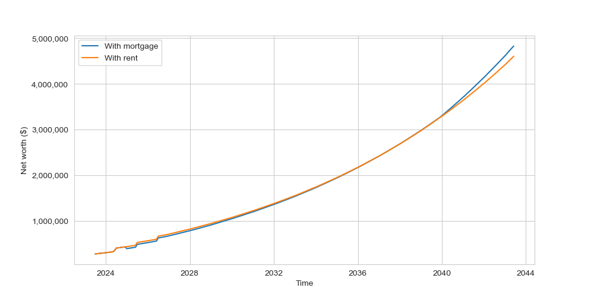
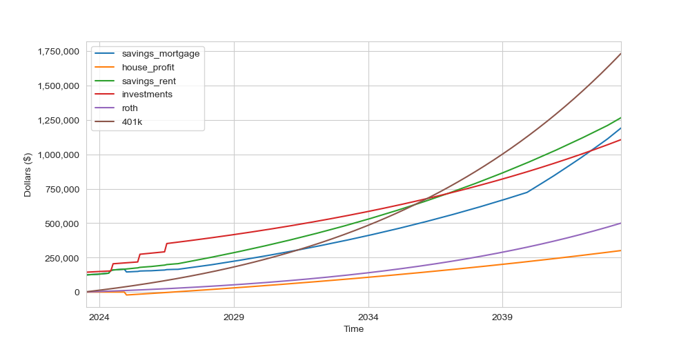

# FinancialPlanning
Financial planning, especially for those in tech looking to buy a house.

Feel free to submit an issue or PR if you find areas for improvement.

## 1. Install packages
```cmd
pip install -r requirements.txt
```

## 2. Run financial scenario
```cmd
python mortgage.py --cfg settings.yml
```

The key columns to look at here are `net_worth_mortgage` and `net_worth_rent`. The other columns break down the components of net worth. The `net_worth_mortgage` column adds all values except `savings_rent`. If you have substantial savings or investments that you want to be counted in the net worth computation, then specify the parameters in `settings.yml` placed under the "Current net-worth settings" title.

```cmd
Annual results:
      savings_mortgage  house_profit  savings_rent  investments       roth        401k  net_worth_mortgage  net_worth_rent
2023          24027.51     -21645.97      53475.19     64287.01    3342.92    11571.66            81583.14       132676.80
2024          79367.78      -5253.45     128959.14    137574.21   10730.79    37145.04           259564.37       314409.18
2025         105474.71      11806.93     176774.12    220806.61   19136.57    66241.98           423466.80       482959.28
2026         133749.00      29562.38     228207.95    315017.43   28666.59    99230.49           606225.89       671122.46
2027         192536.43      48041.21     309539.12    337068.65   39437.03   136512.80           753596.12       822557.60
2028         255812.85      67272.90     397011.65    360663.45   51574.87   178528.41           913852.49       987778.38
2029         323843.33      87288.11     490986.71    385909.90   65218.77   225757.29          1088017.40      1167872.67
2030         396906.95     108118.78     591844.56    412923.59   80520.10   278723.42          1277192.83      1364011.68
2031         475297.50     129798.12     699985.47    441828.24   97644.04   337998.60          1482566.50      1577456.35
2032         559324.25     152360.71     815830.69    472756.22  116770.79   404206.57          1705418.52      1809564.26
2033         649312.66     175842.53     939823.55    505849.15  138096.82   478027.45          1947128.61      2061796.97
2034         745605.23     200281.04    1072430.52    541258.59  161836.32   560202.64          2209183.83      2335728.07
2035         848562.30     225715.22    1214142.32    579146.69  188222.68   651540.03          2493186.92      2633051.72
2036         958562.97     252185.62    1365475.18    619686.96  217510.12   752919.66          2800865.33      2955591.93
2037        1076005.99     279734.46    1526972.04    663065.05  249975.52   865299.89          3134080.92      3305312.50
2038        1236255.61     308405.69    1699203.89    709479.60  285920.28   989724.05          3529785.23      3684327.82
2039        1443935.72     338245.03    1882771.13    759143.18  325672.42  1127327.62          3994323.97      4094914.34
2040        1666252.24     369300.06    2078305.02    812283.20  369588.86  1279346.04          4496770.40      4539523.11
2041        1904043.78     401620.33    2286469.20    869143.02  418057.79  1447123.13          5039988.06      5020793.14
2042        2158192.64     435257.38    2507961.21    929983.03  471501.40  1632120.22          5627054.68      5541565.87
2043        2299087.37     452586.38    2631330.96    961981.93  500230.60  1731567.47          5945453.75      5825110.96

Monthly results:
            savings_mortgage  house_profit  savings_rent  investments       roth        401k  net_worth_mortgage  net_worth_rent
2023-07-01          17483.77     -28285.33      38978.83     62500.00     541.67     1875.00            54115.11       103895.50
2023-08-01          19205.60     -26966.28      42270.99     62853.38    1089.46     3771.20            59953.36       109985.03
2023-09-01          20752.05     -25642.84      45397.81     63208.77    1643.43     5688.79            65650.19       115938.79
2023-10-01          22095.61     -24314.98      48331.85     63566.16    2203.63     7627.94            71178.35       121729.57
2023-11-01          23202.00     -22982.70      51038.85     63925.57    2770.11     9588.84            76503.81       127323.37
...                      ...           ...           ...          ...        ...         ...                 ...             ...
2043-02-01        2205055.58     440995.31    2549073.28    940529.28  480923.97  1664736.83          5732240.98      5635263.37
2043-03-01        2228538.09     443878.63    2569646.49    945847.17  485692.52  1681243.35          5785199.76      5682429.53
2043-04-01        2252044.05     446771.56    2590220.40    951195.13  490499.62  1697883.31          5838393.66      5729798.46
2043-05-01        2275564.08     449674.13    2610785.53    956573.33  495345.55  1714657.69          5891814.77      5777362.10
2043-06-01        2299087.37     452586.38    2631330.96    961981.93  500230.60  1731567.47          5945453.75      5825110.96
```

where 

`net_worth_mortgage = savings_mortgage + house_profit + investments + roth + 401k`

`net_worth_rent = savings_rent + investments + roth + 401k`

These numbers are visualized below (plots conducted inside `mortgage.py`):




### Net worth portfolio in final year:


**Note:** if you are curious about the estimations from more specific components of the savings_mortgage or savings_rent (etc.), more resolute termainal printouts are available if you increase the `verbose` parameter in your `settings.yml` file.

***


## 3. Run a grid search across a financial scenario

Using `settings_optimize.yml` (for example), changes to values on the parameters within `settings.yml` can be conducted to observe how it effects net worth.

```cmd
python mortgage.py --cfg settings_optimize.yml
```

For example, one can grid search the best loan duration, down payment, and optimal time to purchase a home.

```cmd
     amount_down  loan_duration  housePurchase_year_investigate  housePurchase_month_investigate  net_worth_mortgage  net_worth_rent
481     100000.0             10                            2024                                6          6068285.90      5825110.96
401      90000.0             10                            2024                                6          6060367.64      5825110.96
160      60000.0             10                            2024                                3          6053779.40      5825110.96
321      80000.0             10                            2024                                6          6052449.12      5825110.96
482     100000.0             10                            2024                                9          6047665.26      5825110.96
80       50000.0             10                            2024                                3          6044287.48      5825110.96
241      70000.0             10                            2024                                6          6042565.29      5825110.96
402      90000.0             10                            2024                                9          6039747.00      5825110.96
0        40000.0             10                            2024                                3          6034796.56      5825110.96
161      60000.0             10                            2024                                6          6033074.53      5825110.96
322      80000.0             10                            2024                                9          6031828.48      5825110.96
483     100000.0             10                            2024                               12          6027128.01      5825110.96
81       50000.0             10                            2024                                6          6023582.61      5825110.96
242      70000.0             10                            2024                                9          6021944.65      5825110.96
403      90000.0             10                            2024                               12          6019209.75      5825110.96
1        40000.0             10                            2024                                6          6014091.69      5825110.96
162      60000.0             10                            2024                                9          6012453.89      5825110.96
323      80000.0             10                            2024                               12          6011291.23      5825110.96
484     100000.0             10                            2025                                3          6006673.32      5825110.96
82       50000.0             10                            2024                                9          6002961.97      5825110.96
243      70000.0             10                            2024                               12          6001407.40      5825110.96
404      90000.0             10                            2025                                3          5998755.06      5825110.96
2        40000.0             10                            2024                                9          5993471.05      5825110.96
163      60000.0             10                            2024                               12          5991916.64      5825110.96
324      80000.0             10                            2025                                3          5990836.54      5825110.96
Note: `NaN` values indicate that your cash savings balance had < $0 at some point in time.
```

The results displayed in the directory (`results/settings_optimize.yml/`) are the setting with the highest `net_worth_mortgage`.
