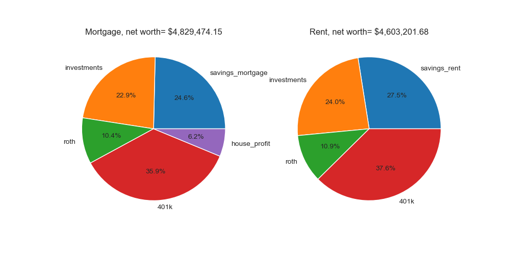

# FinancialPlanning
Financial planning, especially for those in tech looking to buy a house.

Feel free to submit an issue or PR if you find areas for improvement.

## 1. Install packages
```cmd
pip install -r requirements.txt
```

## 2. Run financial scenario
```cmd
python mortgage.py --cfg settings.yml
```

The key columns to look at here are `net_worth_mortgage` and `net_worth_rent`. The other columns break down the components of net worth. The `net_worth_mortgage` column adds all values except `savings_rent`. If you have substantial savings or investments that you want to be counted in the net worth computation, then specify the parameters in `settings.yml` placed under the "Current net-worth settings" title.

```cmd
Annual results:
      savings_mortgage  house_profit  savings_rent  investments       roth        401k  net_worth_mortgage  net_worth_rent
2023         116569.66          0.00     116569.66     100000.0    3342.92    11571.66           231484.25       231484.25
2024         146645.42          0.00     146645.42     100000.0   10730.79    37145.04           294521.24       294521.24
2025         148272.08     -10148.65     178940.73     100000.0   19136.57    66241.98           323501.98       364319.28
2026         172662.19       2393.69     213585.02     100000.0   28666.59    99230.49           402952.95       441482.10
2027         198766.27      15447.02     250714.56     100000.0   39437.03   136512.80           490163.13       526664.40
2028         229131.08      29032.17     290472.73     100000.0   51574.87   178528.41           588266.53       620576.01
2029         261838.57      43170.79     333010.40     100000.0   65218.77   225757.29           695985.42       723986.46
2030         296796.04      57885.45     378486.33     100000.0   80520.10   278723.42           813925.01       837729.85
2031         334131.16      73199.60     427067.52     100000.0   97644.04   337998.60           942973.41       962710.17
2032         373978.23      89137.68     478929.63     100000.0  116770.79   404206.57          1084093.26      1099906.98
2033         416478.45     105725.09     534257.40     100000.0  138096.82   478027.45          1238327.81      1250381.66
2034         461780.32     122988.31     593245.10     100000.0  161836.32   560202.64          1406807.59      1415284.06
2035         510039.97     140954.85     656097.00     100000.0  188222.68   651540.03          1590757.53      1595859.71
2036         561421.55     159653.38     723027.87     100000.0  217510.12   752919.66          1791504.72      1793457.65
2037         616097.60     179113.72     794263.45     100000.0  249975.52   865299.89          2010486.73      2009538.86
2038         674249.45     199366.90     870041.03     100000.0  285920.28   989724.05          2249260.67      2245685.36
2039         736072.11     220445.22     950610.00     100000.0  325672.42  1127327.62          2509517.37      2503610.04
2040         857449.05     242382.31    1036232.42     100000.0  369588.86  1279346.04          2848766.25      2785167.31
2041         987358.43     265213.15    1127183.65     100000.0  418057.79  1447123.13          3217752.50      3092364.58
2042        1126288.64     288974.15    1223753.01     100000.0  471501.40  1632120.22          3618884.41      3427374.64
2043        1205106.41     301215.25    1280049.19     100000.0  500230.60  1731567.47          3838119.73      3611847.27

Monthly results:
            savings_mortgage  house_profit  savings_rent  investments       roth        401k  net_worth_mortgage  net_worth_rent
2023-07-01         102486.33          0.00     102486.33     100000.0     541.67     1875.00           204903.00       204903.00
2023-08-01         105301.54          0.00     105301.54     100000.0    1089.46     3771.20           210162.20       210162.20
2023-09-01         108118.47          0.00     108118.47     100000.0    1643.43     5688.79           215450.68       215450.68
2023-10-01         110936.17          0.00     110936.17     100000.0    2203.63     7627.94           220767.74       220767.74
2023-11-01         113753.62          0.00     113753.62     100000.0    2770.11     9588.84           226112.56       226112.56
...                      ...           ...           ...          ...        ...         ...                 ...             ...
2043-02-01        1152407.15     293027.39    1242465.99     100000.0  480923.97  1664736.83          3691095.35      3488126.80
2043-03-01        1165527.05     295064.15    1251845.19     100000.0  485692.52  1681243.35          3727527.08      3518781.07
2043-04-01        1178684.98     297107.70    1261236.96     100000.0  490499.62  1697883.31          3764175.60      3549619.89
2043-05-01        1191878.86     299158.06    1270639.10     100000.0  495345.55  1714657.69          3801040.15      3580642.33
2043-06-01        1205106.41     301215.25    1280049.19     100000.0  500230.60  1731567.47          3838119.73      3611847.27
```

where 

`net_worth_mortgage = savings_mortgage + house_profit + investments + roth + 401k`

`net_worth_rent = savings_rent + investments + roth + 401k`

These numbers are visualized below (plots conducted inside `mortgage.py`):


### Net worth portfolio in final year:



**Note:** if you are curious about the estimations from more specific components of the savings_mortgage or savings_rent (etc.), more resolute termainal printouts are available if you increase the `verbose` parameter in your `settings.yml` file.

***


## 3. Run a grid search across a financial scenario

Using `settings_optimize.yml` (for example), changes to values on the parameters within `settings.yml` can be conducted to observe how it effects net worth.

```cmd
python mortgage.py --cfg settings_optimize.yml
```

For example, one can grid search the best loan duration, down payment, and optimal time to purchase a home.

```cmd
     amount_down  loan_duration  housePurchase_year_investigate  housePurchase_month_investigate  net_worth_mortgage  net_worth_rent
480     100000.0             10                            2024                                3          4350713.50      3896640.04
400      90000.0             10                            2024                                3          4342795.12      3896640.04
320      80000.0             10                            2024                                3          4334876.66      3896640.04
481     100000.0             10                            2024                                6          4332128.38      3896640.04
240      70000.0             10                            2024                                3          4326958.16      3896640.04
401      90000.0             10                            2024                                6          4324209.99      3896640.04
160      60000.0             10                            2024                                3          4319039.97      3896640.04
321      80000.0             10                            2024                                6          4316291.54      3896640.04
482     100000.0             10                            2024                                9          4313606.43      3896640.04
80       50000.0             10                            2024                                3          4308761.91      3896640.04
241      70000.0             10                            2024                                6          4308373.04      3896640.04
402      90000.0             10                            2024                                9          4305688.04      3896640.04
161      60000.0             10                            2024                                6          4300454.85      3896640.04
0        40000.0             10                            2024                                3          4298484.79      3896640.04
322      80000.0             10                            2024                                9          4297769.59      3896640.04
483     100000.0             10                            2024                               12          4295147.02      3896640.04
81       50000.0             10                            2024                                6          4290176.79      3896640.04
242      70000.0             10                            2024                                9          4289851.09      3896640.04
540     100000.0             30                            2024                                3          4288611.46      3896640.04
500     100000.0             15                            2024                                3          4287711.94      3896640.04
403      90000.0             10                            2024                               12          4287228.63      3896640.04
162      60000.0             10                            2024                                9          4281932.90      3896640.04
1        40000.0             10                            2024                                6          4279899.66      3896640.04
323      80000.0             10                            2024                               12          4279310.18      3896640.04
541     100000.0             30                            2024                                6          4278525.49      3896640.04
```

The results displayed in the directory (`results/settings_optimize.yml/`) are the setting with the highest `net_worth_mortgage`.
